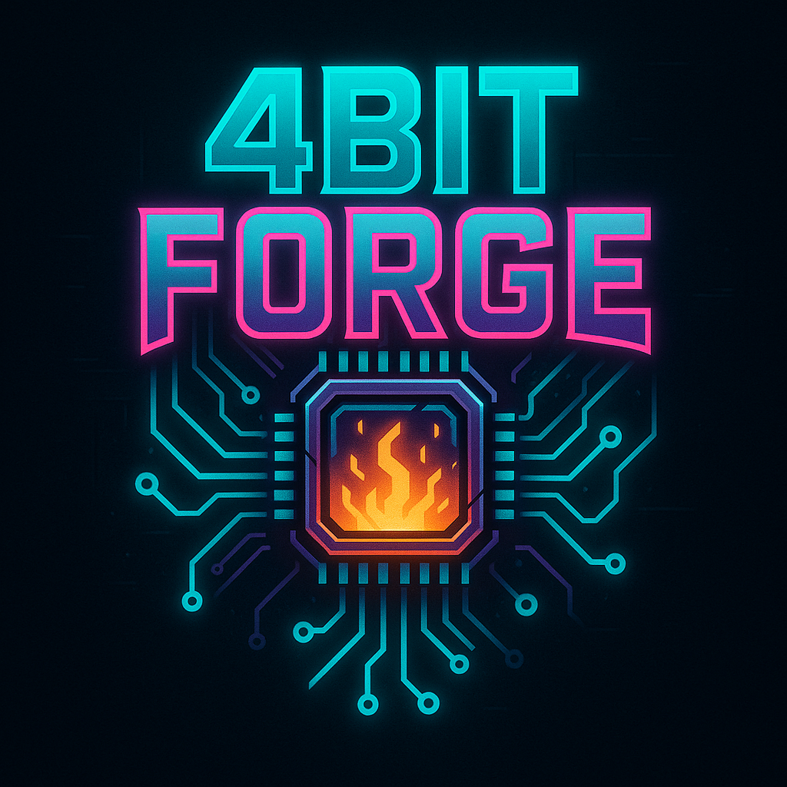

This repo builds upon the solid foundation laid in MoE-Quant. Thank you for your amazing work!
Supports: MiniMax M2.1, DeepSeek V3.2, Kimi K2, GPT-OSS-120B (Prolly more models)
Runs GPTQ quantization on a Single A100...and its like supa fast...!
Unpacks model weights accordingly (fp8, uint8, packed int32, using checkpoint model's scales etc -> fp16/bf16) instead of neaively just setting weights to fp16/bf16.
Note: Still...WIP..

Todo(s):

- [ ] pack uint8 <- int4?
- [ ] save final model checkpoint for formatting for vllm compatibility
- [ ] confirm frontend didnt break quantization...
- [ ] test inference
- [ ] fp8, fp16, bf16 kernel dispatcher
- [ ] sparsegptq 2:4 vllm inference compatible format
    - [ ] build interblock Mask update sparsegptq 2:4 kernel
    - [ ] Test sparsegptq on gpt 120B oss ("mvp")

- [ ] metrics.py / stat view during compression run (?)
- [ ] multigpu support
- [ ] R&D
    - [ ] spargptq 1:8
    - [ ] Custom Sparse 1:8 Kernels for inference
    - [ ] Monkey patch with transformers/torch nn.Linear
    - [ ] Explore monkey patching with vllm

- [x] io.py + handle quantized layers
- [x] scaffold initial quant.py
- [x] engine.py
- [x] preprocess.py (openplatypus)
